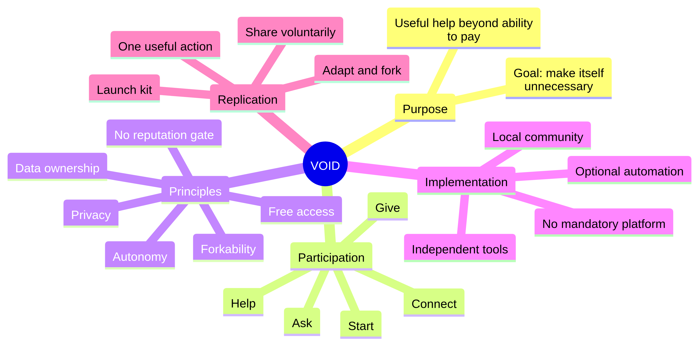

# System Overview

## Purpose

VOID challenges the boundary where useful assistance becomes unavailable because a person cannot pay. The repository frames the project as an **open idea**, not a company, marketplace, gatekeeper, or mandatory platform.

The desired end state is not dependence on VOID itself. The manifesto describes success as a world where people help one another directly and the protocol becomes unnecessary as a named system.[1]

## Core vocabulary

| Term | Meaning in this repository |
|---|---|
| **Give** | Offer a useful service, skill, answer, hour, connection, or other contribution. |
| **Ask** | State a need without treating need as failure. |
| **Help** | Carry out or facilitate useful assistance. |
| **Connect** | Introduce a person who needs help to a person or community able to help. |
| **Start** | Create an independent VOID space in a place where people already gather. |
| **Community** | Any local or online group that adopts the idea and defines its own operating rules. |
| **Protocol** | The portable set of principles and participation expectations, not a centralized service. |

## What exists in the repository

The repository is a compact documentation system with five functional layers:

1. **Meaning:** the manifesto explains why the idea exists.
2. **Norms:** the principles define what a compatible implementation should preserve.
3. **Protocol:** the protocol document states the common model and conformance language.
4. **Action:** the challenge turns the idea into a single useful act.
5. **Replication:** the launch kit makes a new community easy to start and copy.

## What is explicitly out of scope

No source file defines authentication, matching algorithms, payment processing, identity verification, moderation infrastructure, reputation scoring, hosting, APIs, or a canonical database. Any such feature belongs to an independent implementation and must remain subordinate to the documented principles.

## Concept map

## References

[1]: https://github.com/p2id/Void_Protocols/blob/main/manifesto/MANIFESTO.md "VOID Manifesto"
