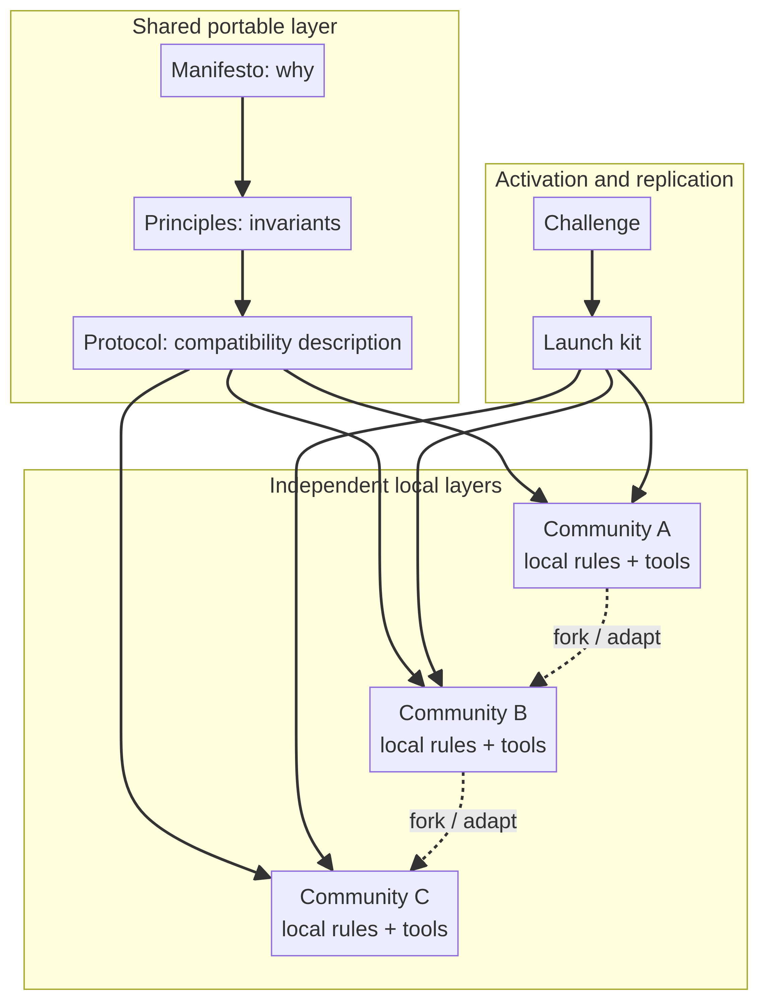

# Architecture

## Architectural thesis

VOID uses a **federated, implementation-independent architecture**. The repository provides a shared protocol vocabulary while leaving ownership, tooling, moderation, storage, and local culture to each community.

This is not a distributed software architecture in the usual sense because the repository contains no network protocol or service boundary. It is a distributed **social and governance architecture**: independent implementations can remain compatible without sharing a central operator.

## Layers

| Layer | Repository source | Responsibility | Required central service? |
|---|---|---|---|
| Intent | `manifesto/MANIFESTO.md` | States the problem and desired direction. | No |
| Principles | `principles/PRINCIPLES.md` | Defines non-negotiable values such as free access, autonomy, privacy, and transferability. | No |
| Protocol | `protocol/PROTOCOL.md` | Describes actors, actions, governance, safety, and conceptual conformance. | No |
| Activation | `challenge/CHALLENGE.md` | Converts reading into one concrete action. | No |
| Replication | `launch/LAUNCH_KIT.md` | Provides copyable introductions, offer/request/help/start templates, and a loop. | No |
| Local implementation | Independent community | Chooses platform, rules, moderation, and tools. | No shared service |

## Boundary rule

A local implementation may add tooling, but it should not turn optional tooling into a universal gate. Search, recommendations, automation, ratings, and matching may assist people; the principles say that human choice remains primary.[1]

## Portability properties

The protocol is designed to remain useful when a specific website, application, server, or community disappears. This creates a strong portability requirement: a community should be able to preserve its knowledge, export its data, and reproduce its operating model elsewhere.

## References

[1]: https://github.com/p2id/Void_Protocols/blob/main/principles/PRINCIPLES.md "VOID Principles"
