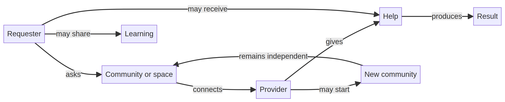
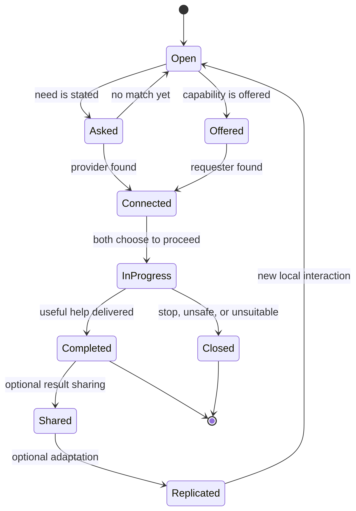

# Protocol Model

## Actors

The protocol describes roles rather than privileged account types. One person may occupy several roles in one interaction.

- **Requester:** asks for useful help.
- **Provider:** offers or performs useful help.
- **Connector:** introduces a requester to a provider.
- **Community:** supplies context, local rules, and optional coordination.
- **Independent implementer:** builds a tool, interface, integration, or alternative community.

## Core invariants

A VOID-compatible implementation preserves these conditions:

| Invariant | Operational meaning |
|---|---|
| Free useful service | The core help is not conditional on payment. |
| Open participation | People may give, ask, help, connect, or start without membership in a central organization. |
| Voluntary participation | No compulsory repayment, referral, or platform dependence. |
| No mandatory central authority | Communities can govern themselves and fork the model. |
| Autonomy | Communities retain their own rules, culture, and tools. |
| Forkability | Anyone can copy, adapt, improve, and redistribute an implementation. |
| No reputation gate | Lack of existing status cannot permanently block participation. |
| Privacy and data control | Private-by-default behavior, public-by-choice sharing, and exportability are expected design directions. |

## Compatibility test

A system can describe itself as VOID-compatible when it preserves the fundamental principles above. The repository explicitly describes this as a **description**, not a certification. No certification authority is required.[1]

## State model

The protocol does not require every interaction to follow one rigid workflow. The following state model is a useful implementation view derived from the documented loop.

## References

[1]: https://github.com/p2id/Void_Protocols/blob/main/protocol/PROTOCOL.md "VOID Protocol v0.1"
