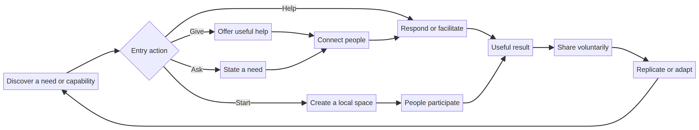
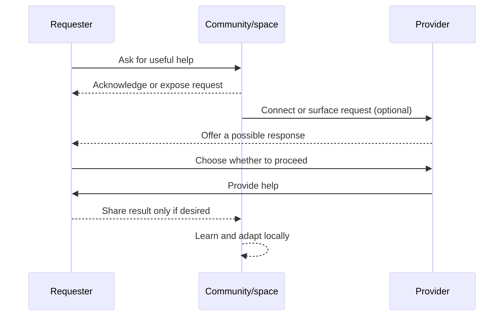

# Operational Flows

## Canonical loop

The launch kit names the repeatable loop:

> `DISCOVER → GIVE / ASK → CONNECT → HELP → RESULT → SHARE → REPLICATE`

The sequence is intentionally lightweight. A person can complete a useful action without creating a large organization or waiting for a platform-wide process.

## Request-to-help sequence

The connector step is optional. A requester and provider may meet directly. Likewise, sharing and replication are voluntary and should not expose personal information without consent.

## Four entry actions

The challenge document offers four valid starting points:

| Entry action | Minimum behavior |
|---|---|
| **Give** | Offer something useful for free. |
| **Ask** | Describe a need and request help. |
| **Help** | Respond to someone’s request. |
| **Start** | Create an independent VOID space. |

## One-action rule

The launch kit reduces activation to one useful action. This protects the project from confusing attention with participation: a single real act is more valuable than passive visibility, manufactured activity, or forced referral.

## Negative flows

The documents also identify behaviors that should not be used to spread the idea: spam, mass messaging strangers, fake testimonials, fabricated statistics, manipulation, and forced referrals. These are not implementation details; they are safety constraints on community growth.

## References

[1]: https://github.com/p2id/Void_Protocols/blob/main/launch/LAUNCH_KIT.md "VOID Launch Kit"
[2]: https://github.com/p2id/Void_Protocols/blob/main/challenge/CHALLENGE.md "The VOID Challenge"
