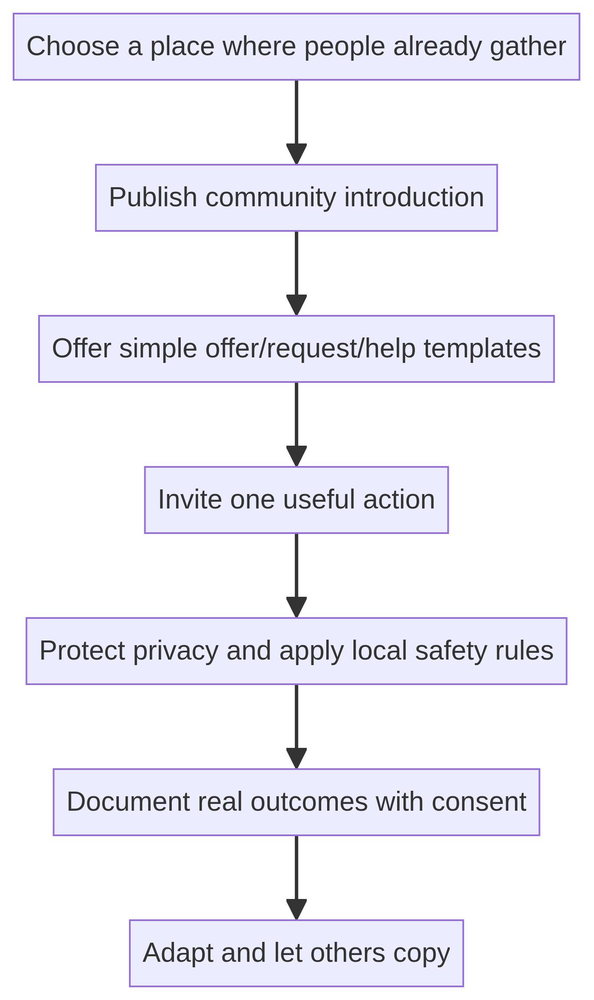

# Community Launch Kit

## Adoption sequence

The launch kit is a copy-and-adapt package rather than a deployment script. A new community chooses an existing gathering place, publishes an introduction, and offers simple templates for participation.

## Reusable templates

The source launch kit provides four primary templates:

- **Offer:** what the person can do, who it can help, availability, and a clear “Cost: Free” statement.
- **Request:** what the person needs and enough context for others to respond.
- **Help:** how someone can respond to another person’s need.
- **Start:** how someone announces a new independent VOID space.

## Local adaptation checklist

A community should decide its own platform, moderation process, privacy defaults, reporting route, local safety rules, and data-retention practices. It should preserve the core invariants while adapting the mechanics to local context.

The repository discourages presenting one implementation as the owner or official authority for all communities. A local space may use the name, adapt the text, or build an independent fork.

## Examples directory

`examples/README.md` reserves a place for real interactions and independent implementations. It prohibits fabricated testimonials, statistics, users, or case studies. Publishing identifying details requires privacy protection and consent.

## References

[1]: https://github.com/p2id/Void_Protocols/blob/main/launch/LAUNCH_KIT.md "VOID Launch Kit"
[2]: https://github.com/p2id/Void_Protocols/blob/main/examples/README.md "VOID Examples guidance"
