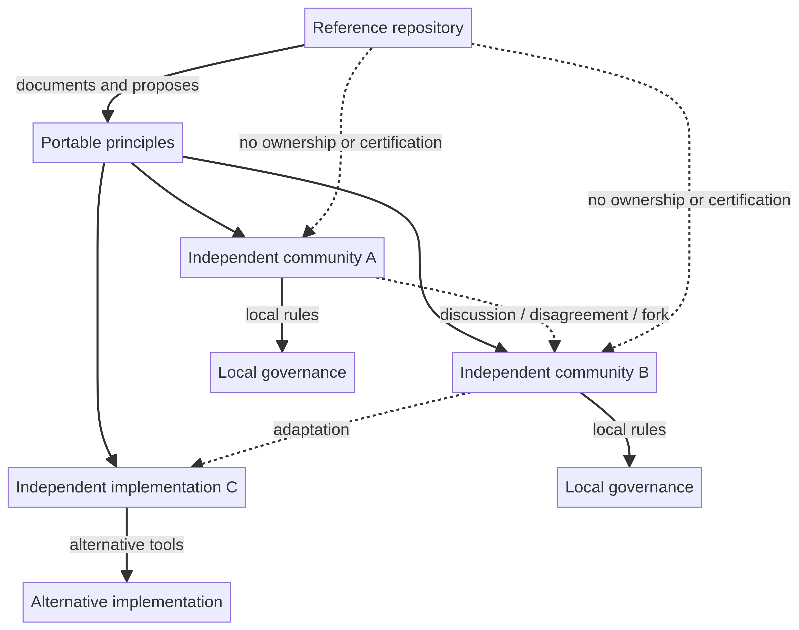

# Governance, Safety, and Privacy

## Governance model

The protocol rejects mandatory central authority. Changes may arise through open discussion, implementation, experimentation, consensus, disagreement, and forks. The repository is one reference documentation space, not the owner of every implementation.

## Local rules

Independent communities may establish context-specific safety, legal, and risk-management rules. The protocol does not create a universal approval or enforcement system, and it does not permit harmful or illegal activity.

## Repository conduct

The repository’s Code of Conduct applies to interactions in this repository. It asks participants to act respectfully, protect privacy, avoid harassment, spam, manipulation, and deliberate deception, and report concerns through the available private channel.

This local code is not presented as a universal law for every independent VOID community. Each community may define and apply its own rules.

## Privacy and data ownership

The principles state “private by default, public by choice.” A real implementation should therefore make sharing boundaries explicit, minimize unnecessary collection, obtain consent before publishing identifying details, and provide practical ways to preserve, export, and move information.

## Risk interpretation

Because the repository does not define identity verification, reputation scoring, or dispute resolution, an implementation must not imply that participation is automatically safe. Local communities need their own context-specific safeguards, especially for sensitive, legal, medical, financial, or in-person interactions.

## References

[1]: https://github.com/p2id/Void_Protocols/blob/main/protocol/PROTOCOL.md "VOID Protocol v0.1"
[2]: https://github.com/p2id/Void_Protocols/blob/main/CODE_OF_CONDUCT.md "VOID Code of Conduct"
[3]: https://github.com/p2id/Void_Protocols/blob/main/principles/PRINCIPLES.md "VOID Principles"
