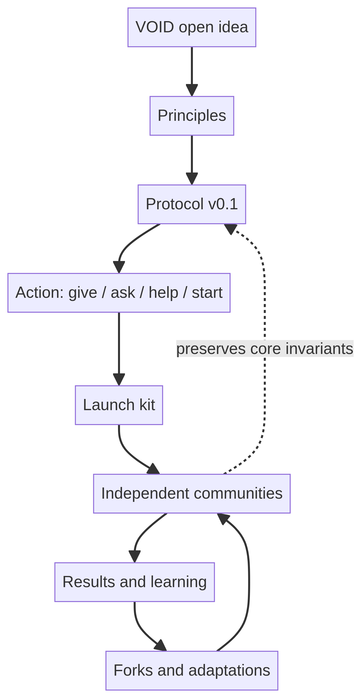

# VOID Code Wiki

> **VOID is an open protocol for making useful help available without making payment, reputation, or central ownership a prerequisite.**

This wiki translates the `p2id/Void_Protocols` repository into a navigable system model. The repository contains no application runtime, package manifest, database schema, or executable service. Its “code” is a set of normative documents, templates, and adoption patterns that communities can copy, adapt, and fork.

## Start here

- [System overview](01-system-overview.md) — the protocol’s purpose, boundaries, and vocabulary.
- [Architecture](02-architecture.md) — how the repository’s documents fit together and how independent communities relate to the protocol.
- [Protocol model](03-protocol-model.md) — actors, invariants, participation rules, and conformance.
- [Operational flows](04-operational-flows.md) — offer, request, connection, help, result, and replication flows.
- [Community launch kit](05-community-launch-kit.md) — the reusable templates and adoption sequence.
- [Governance, safety, and privacy](06-governance-safety.md) — decentralization, local rules, reporting, privacy, and data ownership.
- [Repository map](07-repository-map.md) — source-to-wiki mapping and maintenance notes.
- [Visualization index](08-visualizations.md) — every diagram and what question it answers.

## System at a glance

The central distinction is between **the idea** and **an implementation**. VOID does not require one website or one operator. A neighborhood group, university, chat server, website, or two people can implement the basic loop independently.

## Source repository

[Open `p2id/Void_Protocols` on GitHub][1]. The wiki is derived from the public repository at the time of analysis. It preserves the repository’s stated limits: it does not claim that this repository owns every VOID community, and it does not infer features that are not documented.

## License

The repository states that it is released under the [Unlicense][2].

## References

[1]: https://github.com/p2id/Void_Protocols "VOID Protocols source repository"
[2]: https://unlicense.org "The Unlicense"
